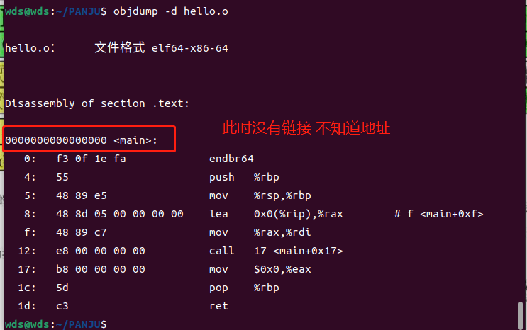

## * 编译 链接
    * _.c_ --> _.l_ -->_.s_-->_.o_-->_.out_  四个箭头分别代表 预编译 编译 汇编 链接
  实验
  在 gcc编译后的a.out中 vi打开
  如下
  
  输入xxd命令
  
  ``:help %`` xxd是格式控制 
  * gcc的文档
  ``man gcc`` 
  社区维护的文档 too long dont read
  ``tldr gcc``
  在安装``tldr``后出现了 ``No tldr entry for gcc``
  >fix: tldr -u #update

  -S对文件进行编译
  
  得到.s
  -c 得到a.o编译完成

  objdump 对编译完成的a.o进行反汇编
  -d disassembel
  
  左侧为文件内容, 右侧是翻译出的汇编代码

##### * 预编译

  #include 原样复制粘贴
  命令行生存的准则是一切在命令行中查询 阅读命令的日志
  gcc -o --verbose 啰嗦 给开发者提交bug
  ``gcc hello.c --verbose``
  
  查看预编译的结果 -E
  在include运行后， 所有内容被粘贴进来
  查看
  ``gcc -E hello.c | less``
  其实可以将stdio内用到的函数单独的 进行替换 
  
  before:
  
  
  after: 只剩下最后的内容
  
  也可以发现，只出现了aa==bb的情况，因为所有的预编译的变量都是字符串类型进去的
  粘贴的时候 中间的空格问题  ##双井号被称为连接符
  ``# define SYSTEM sys ## tem``