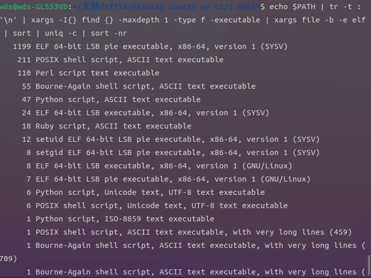
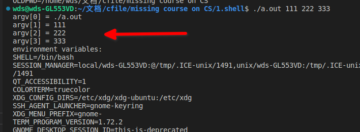

df/ 查看磁盘分区使用情况
find . -name "*.[ch]" 查找当前目录下.c .h文件
grep "\bint i\b" a.c 查找文件中定义打变量i打位置
iconv -f gbk -t utf-8 file.txt 文件编码转换

比较两文件 文本 vimdiff 非文本 diff md5sum

列出一个C语言项目中所有被包含过得头文件
``find . -name "*.[ch]" | xargs grep "#include" | sort | uniq``
uniq 去重 

## linux filesystem hierarchy standard


busybox 常见工具套件 
标准工具 /bin目录 有上千个目录
包搜索:https://packages.ubuntu.com/

工具如何运行? 源码 静态
踪迹 trace 动态


strace: system call trace 系统调用信息 可以大致了解程序打关键行为
 i.e. 当前目录并没有ls 怎么找到打
 strace -f bash -c ls
 strace -f bash -c "PATH='aaa:bbb:ccc' ls"
 单独运行PATH='aaa:bbb:ccc'ls 找不到 $PATH 被改了


 strace -o strace.log -f man ls 
 tail -f strace.log #在另一个窗口执行 打印最后一行 查看变化


## shell
altB altF 单词移动 
history !+数字 !匹配
通配符*任意长 ?任意一个 []集合中任意一个 符号扩展{}-{}
alias 设置别名 写入.bashrc 

正则 比通配符强大 配合grep awk sed vim
i.e.匹配email的例子


## 任务管理
jobs任务栏 
fg 最大化
ctrlZ 后台运行  或命令末尾加& bg 前台
    i.e. yes& 此时ctrlZ不管用 进ps a kill掉

任务管理器 ps aux, top, htop
kill 

## 重定向
linux程序运行时默认打开3个文件 0标准输入 1标准输出 2标准错误
使用 lsof -p 进程号 查看打开的文件 list of open file

将标准输出重定向到文件 
 i.e.
 ls > result.txt
 strace -o strace.log -f bash -c "ls > result.txt"
    其中dup2 重定向将输出1号文件给替换了 ls并不知道输出去哪里
 yes > /dev/null & #读到进程号pgrep
 lsof -p 'pgrep yes'

>> 追加

只输出标准错误 ls 2> /dev/null

无需手动输入 sort <result.txt

## 管道
 i.e. yes | cat > /dev/null
 再通过lsof 查看 cat 和yes 的管道 pipe 号码一致


## 一些组合
通过管道进行组合
```shell
watch -t -n 1 "echo '现在是北京时间'; \date ; echo '但在西安'"

# 无人重试操作
while ! git push origin HEAD; do echo "retry"; done
while [[`seq 1 10 | shuf | head -n 1` != "1"]]; do echo "retry"; done

# 主频监视器
watch -n 1 "cat /proc/cpuinfo | grep MHz | awk '{print \$1 NR \$3 \$4 \$2}'"

# 打包特定文件上传
find . -name "*.pdf" | xargs tar cj | ssh wds@wds-GL553VD@localhost 'mkdir tmp2; cd tmp2; > pdf.tar.bz2'

解压 tar xvjf 
```

## 系统工具是什么
``echo $PATH | tr -t : '\n' | xargs -I{} find {} -maxdepth 1 -type f -executable | xargs file -b -e elf | sort | uniq -c | sort -nr``
大部分是可执行文件 elf  小部分是脚本


查看which
vim `which -a which | grep -v shell | head -n 1`

自制工具 man bash 
c程序 
>命令行参数 = main()函数的参数
用getopt()库函数识别并处理参数
用fopen()打开文件
用fscanf()/fread()从标准输入读取
用fprintf()/fwrite()将结果写入到标准输出
main()函数的返回值 = 命令的返回值

main的原型
```c
int main(int argc, char *argv[], char *envp[]);
```

查看给出的这个例子 argv.c


## SFTW
	搜索引擎	百科	问答网站
	www.google.com	en.wikipedia.org	stackoverflow.com

安装英文操作系统 -- 方便搜索

## 尝试先进的工具
python vs 计算器
awesome系列 thefuck命令行纠错 
TODO:

## 总结 
学习linux是低成本高收益打 所有问题都可以解决 STFW+RTFM
培养信心 到后期做ysyx实验
从小事做起 试图理解一切事情是怎么发生打
真正成为计算机打用户 花一周学linux和命令行 
